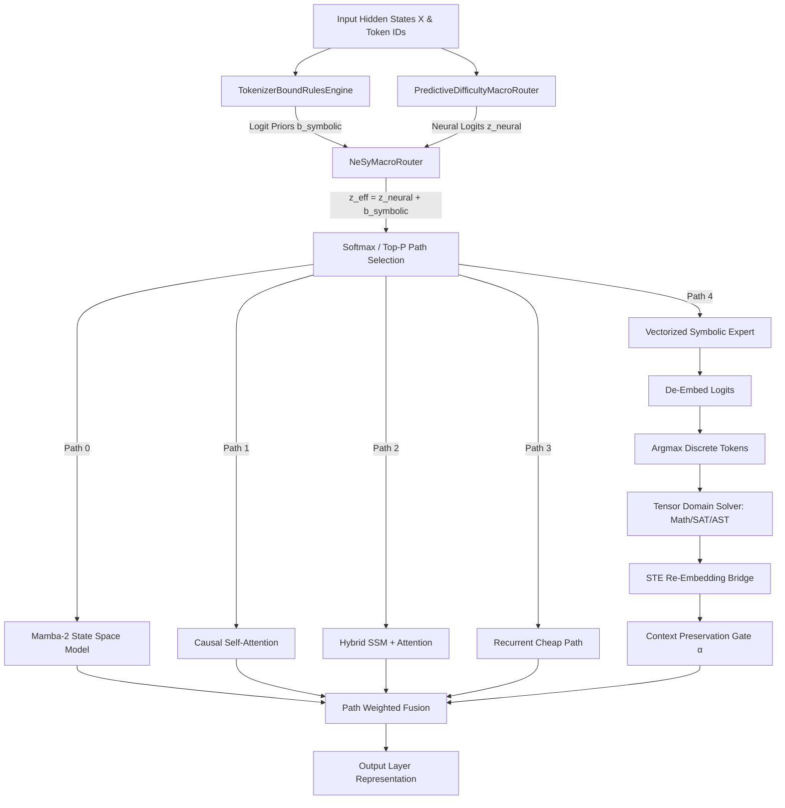

# DAPH NeSy-MoE v1.1 Extended

> **Differentiable Adaptive Predictive Hybrid Neurosymbolic Mixture-of-Experts**
> *Unifying System 1 Neural Intuition with System 2 Symbolic Reasoning inside PyTorch Transformer & State-Space Architectures.*

[](https://www.python.org/)
[](https://pytorch.org/)
[](LICENSE)
[]()
[](daph_nesy_v1_0.py)

---

## 📌 Table of Contents
- [Executive Overview](#-executive-overview)
- [Key Architectural Highlights](#-key-architectural-highlights)
- [System Architecture & Routing Flow](#-system-architecture--routing-flow)
- [Core Components Deep-Dive](#-core-components-deep-dive)
  - [1. NeSyMacroRouter](#1-nesymacrorouter)
  - [2. TokenizerBoundRulesEngine](#2-tokenizerboundrulesengine)
  - [3. VectorizedSymbolicExpert \& Domain Solvers](#3-vectorizedsymbolicexpert--domain-solvers)
  - [4. NeSyOutputVerifier](#4-nesyoutputverifier)
  - [5. NeSyDecoderLayer](#5-nesydecoderlayer)
  - [6. ExFusion Model Merging (DARE → TIES → Fisher)](#6-exfusion-model-merging-dare--ties--fisher)
- [Installation \& Prerequisites](#-installation--prerequisites)
- [Quick Start \& Code Examples](#-quick-start--code-examples)
  - [Basic Setup](#basic-setup)
  - [Registering Custom Solvers](#registering-custom-solvers)
  - [Grammar Logit Masking](#grammar-logit-masking)
- [Pretrained Model Runner (`run_model.py`)](#-pretrained-model-runner-run_modelpy)
- [Verification \& Test Suite](#-verification--testing)
- [Repository File Structure](#-repository-directory-structure)
- [Mathematical Foundations](#-mathematical-foundations)
- [License \& Citation](#-license--citation)

---

## 🧠 Executive Overview

Standard Deep Learning models excel at **System 1 tasks** (pattern recognition, fluent language generation, associative recall) but frequently fail or hallucinate during **System 2 tasks** (exact arithmetic, formal logic, Boolean satisfiability, strict syntax generation). Post-hoc decoding filters or external API tools often break end-to-end backpropagation and increase latency.

**DAPH NeSy-MoE v1.1 Extended** solves this by injecting symbolic logic directly **into the routing mathematics before softmax** and bridging non-differentiable solver execution back into continuous representations via a **Straight-Through Estimator (STE)** gradient bypass.

```
                    ┌──────────────────────────────────────────────┐
                    │            Input Sequence / Tokens           │
                    └──────────────────────┬───────────────────────┘
                                           │
                        ┌──────────────────┴──────────────────┐
                        │    Predictive Difficulty Scoring    │
                        │        𝓓(x) ∈ [0.0, 1.0]           │
                        └──────────────────┬──────────────────┘
                                           │
               ┌───────────────────────────┼───────────────────────────┐
               ▼                           ▼                           ▼
      ┌─────────────────┐         ┌─────────────────┐         ┌─────────────────┐
      │  Path 0: SSM    │         │ Path 1: Attention│        │ Path 2: Hybrid  │
      │  (Mamba-2 O(N)) │         │ (Causal Multi-H)│        │ (SSM + Attn)    │
      └────────┬────────┘         └────────┬────────┘         └────────┬────────┘
               │                           │                           │
               └───────────────────────────┼───────────────────────────┘
                                           │
                   ┌───────────────────────┴───────────────────────┐
                   ▼                                               ▼
      ┌─────────────────────────┐                     ┌─────────────────────────┐
      │  Path 3: Dynamic Depth  │                     │  Path 4: Symbolic Expert│
      │  (Recurrent / Cheap)    │                     │  (Exact Tensor Solvers) │
      └────────────┬────────────┘                     └────────────┬────────────┘
                   │                                               │
                   └───────────────────────┬───────────────────────┘
                                           ▼
                    ┌──────────────────────────────────────────────┐
                    │     Fused Output Representation & Meta       │
                    └──────────────────────────────────────────────┘
```

---

## ⚡ Key Architectural Highlights

* **5-Path Adaptive Macro-Routing**: Dynamically dispatches tokens/batches across **Mamba-2 SSM** (`0`), **Causal Attention** (`1`), **Full Hybrid** (`2`), **Recurrent Depth** (`3`), and **Vectorized Symbolic Expert** (`4`).
* **Additive Symbolic Logit Priors**: Modifies router logits *before* softmax ($z_{\text{eff}} = z_{\text{neural}} + b_{\text{symbolic}}$) with hard mandates ($+10^5$), hard forbids ($-10^5$), or soft domain biases.
* **Straight-Through Estimator (STE) Gradient Bridge**: Discretizes neural hidden states to token IDs, executes parallel domain solvers, and re-embeds the discrete solution while preserving smooth gradient backpropagation through probabilities:
  $$\text{STE} = (\mathbf{1}_{\text{solved}} - \mathbf{p}).\text{detach}() + \mathbf{p}$$
* **Tokenizer-Bound Structural Rules**: Vectorized rule engine mapping math, logic, padding, JSON, SQL, and symbolic trigger tokens across arbitrary tokenizers (`HuggingFace`, `tiktoken`, explicit ID maps).
* **Extensible Domain Solvers**: Out-of-the-box support for exact integer arithmetic, Boolean SAT solving, AST bracket canonicalization, digit squaring, and custom user-defined solvers registered at runtime.
* **Inference-Time Grammar Guardrails**: `NeSyOutputVerifier` enforces balanced brackets and structural constraints via dynamic logit masking during autoregressive decoding.
* **DARE → TIES → Fisher Model Merging**: Merges task-specific experts into base checkpoints with density pruning, sign-consensus voting, and empirical Fisher information diagonal weighting (`daph_hybrid_exfusion_v2_3.py`).

---

## 📐 System Architecture & Routing Flow



---

## 🧩 Core Components Deep-Dive

### 1. `NeSyMacroRouter`
Extends `PredictiveDifficultyMacroRouter` by introducing an additive symbolic prior channel:
```python
z_effective = z_neural + b_symbolic
```
* **Mandate Path**: $+10^5$ (Forces selection regardless of neural confidence).
* **Forbid Path**: $-10^5$ (Blocks path entirely).
* **Neutral**: $0.0$ (Lets predictive difficulty and neural logits govern).

### 2. `TokenizerBoundRulesEngine`
Maps discrete token IDs to macro-routing priors. It auto-resolves character strings against tokenizer vocabularies so rules persist across tokenizer swaps.
* **Math Operators** (`+`, `-`, `*`, `/`, `%`, `=`): Routes to high-precision Attention/Symbolic path.
* **Control/Padding Tokens** (`[PAD]`, `<s>`, `</s>`): Forces fast Cheap path.
* **Logical Symbols** (`&`, `|`, `^`, `~`): Applies soft bias to Mamba-2 SSM.
* **JSON & SQL Tokens** (`{`, `}`, `SELECT`, `FROM`): Soft bias to Transformer Attention.
* **Symbolic Trigger Tokens** (`eval`, `exec`, `solve`, `sat`, `ast`): Mandates Symbolic Expert (`SYMBOLIC_PATH = 4`).

### 3. `VectorizedSymbolicExpert` & Domain Solvers
Executes exact GPU-vectorized logic over tensor batches:
* **`digit_squaring`**: Vectorized mod-10 digit squaring over ASCII tokens.
* **`arithmetic` / `arithmetic_eval`**: Evaluates `+`, `-`, `*` over digit tokens based on preceding operators.
* **`sat` / `sat_boolean`**: Flips Boolean bit tokens (`'0'` $\leftrightarrow$ `'1'`) under `NOT` (`~`, `!`) operations.
* **`ast` / `ast_transformer`**: Canonicalizes mismatched closing delimiters (`]`, `}`) following `(`.
* **`register_solver(name, fn)`**: Allows registering custom PyTorch tensor routines dynamically.

### 4. `NeSyOutputVerifier`
Post-hoc decoding guardrail that analyzes generation state and modifies next-token logits:
```python
logits = verifier.verify_and_correct_logits(generated_ids, next_token_logits)
```
Enforces open/close bracket counts across batch sequences in parallel.

### 5. `NeSyDecoderLayer`
Integrates System 1 hybrid processing with System 2 symbolic routing seamlessly without altering the core DAPH execution signature:
```python
output, meta = nesy_layer(
    hidden_states,
    token_ids=input_ids,
    symbolic_priors=priors  # Optional override
)
```

### 6. ExFusion Model Merging (`DARE → TIES → Fisher`)
Located in [daph_hybrid_exfusion_v2_3.py](daph_hybrid_exfusion_v2_3.py):
1. **DARE Preprocessing**: Randomly drops task vector parameters at rate $p$ and scales remaining weights by $1/(1-p)$.
2. **TIES Trimming & Sign Election**: Trims bottom $k\%$ parameters by magnitude, calculates pure sign-majority consensus voting across experts, and filters conflicting signs.
3. **Fisher Information Diagonal Weighting**: Scales expert contributions by parameter-level empirical Fisher information.

---

## 📦 Installation & Prerequisites

### Prerequisites
* Python 3.10+
* PyTorch 2.1+ (2.8+ recommended)
* `transformers` (for pretrained tokenizer/model integration)

### Setup
Clone the repository and install required dependencies:
```bash
git clone https://github.com/dawsonblock/Daph_fusion.git
cd Daph_fusion
pip install torch transformers
```

---

## 🚀 Quick Start & Code Examples

### Basic Setup

```python
import torch
from daph_hybrid_exfusion_v2_3 import DAPHConfig
from daph_nesy_v1_0 import (
    NeSyDecoderLayer,
    TokenizerBoundRulesEngine,
    VectorizedSymbolicExpert,
)

# 1. Initialize 5-path configuration
config = DAPHConfig(
    hidden_size=768,
    num_attention_heads=12,
    num_paths=5,  # 0: Mamba, 1: Attn, 2: Hybrid, 3: Cheap, 4: Symbolic
    routing_granularity="token",
)

# 2. Setup Rules Engine & Symbolic Expert
vocab_size = 32000
lm_head_weight = torch.randn(vocab_size, config.hidden_size)

rules_engine = TokenizerBoundRulesEngine(num_paths=5)
expert = VectorizedSymbolicExpert(
    hidden_size=config.hidden_size,
    vocab_size=vocab_size,
    lm_head_weight=lm_head_weight,
    domain="arithmetic_eval",
)

# 3. Instantiate NeSy Decoder Layer
layer = NeSyDecoderLayer(
    config=config,
    rules_engine=rules_engine,
    symbolic_expert=expert,
)

# 4. Forward Pass
batch_size, seq_len = 2, 16
hidden_states = torch.randn(batch_size, seq_len, config.hidden_size)
input_ids = torch.randint(0, vocab_size, (batch_size, seq_len))

output, meta = layer(hidden_states, token_ids=input_ids)
print("Layer Output Shape:", output.shape)
print("Router Selected Paths Shape:", meta["selected_paths"].shape)
```

---

### Registering Custom Solvers

```python
import torch
from daph_nesy_v1_0 import register_solver, VectorizedSymbolicExpert

# Define custom vectorized PyTorch function over token ID tensors
def custom_rot13_solver(token_ids: torch.Tensor) -> torch.Tensor:
    # Rotate lowercase ASCII characters ('a'-'z', 97-122) by 13
    is_lower = (token_ids >= 97) & (token_ids <= 122)
    rotated = ((token_ids - 97 + 13) % 26) + 97
    return torch.where(is_lower, rotated, token_ids)

# Register with domain name
register_solver("rot13", custom_rot13_solver)

# Instantiate expert using custom solver
expert = VectorizedSymbolicExpert(
    hidden_size=768,
    vocab_size=32000,
    lm_head_weight=torch.randn(32000, 768),
    domain="rot13",
)
```

---

### Grammar Logit Masking

```python
import torch
from daph_nesy_v1_0 import NeSyOutputVerifier

# Initialize verifier for '(' (40) and ')' (41)
verifier = NeSyOutputVerifier(open_token=40, close_token=41)

# Sequence state: [ "(" ] (1 open bracket)
generated_ids = torch.tensor([[40]]) 
next_logits = torch.randn(1, 32000)

# Mask logits to encourage closing brackets and forbid premature closing
corrected_logits = verifier.verify_and_correct_logits(generated_ids, next_logits)
```

---

## 🤖 Pretrained Model Runner (`run_model.py`)

A full end-to-end integration script [run_model.py](run_model.py) is included in the repository. It:
1. Downloads `distilbert/distilgpt2` from Hugging Face Hub.
2. Runs standard neural generation on text prompts.
3. Connects the Hugging Face tokenizer to `TokenizerBoundRulesEngine`.
4. Executes the full **DAPH NeSy-MoE v1.1 Dual-System Engine**.

Run it via:
```bash
python3 run_model.py
```

---

## 🧪 Verification & Testing

The workspace features comprehensive self-testing scripts verifying all 5 router paths, gradient propagation through STE, rules engines, and model merging routines.

### Run Unit Tests
```bash
python3 test_nesy_v1_0.py
```

### Run Model Merging & ExFusion Engine Self-Tests
```bash
python3 daph_hybrid_exfusion_v2_3.py
```

### Test Results
```
======================================================================
1. symbolic priors mandate paths before softmax (5-path router): OK
2. tokenizer-bound rules engine (extended grammars + 5-path priors): OK
3. vectorized symbolic expert (domain solvers + custom registry + STE grad): OK
4. NeSy output verifier (bracket guardrail): OK
5. end-to-end NeSyDecoderLayer (5-path + priors + expert + grads): OK
6. re_embed aligned init (fallback + explicit source): OK
7. over-closed bracket guardrail (BIAS_FORBID): OK

All NeSy-MoE v1.0 (v1.1 Extended) tests passed (executed live).
======================================================================
```

---

## 📁 Repository Directory Structure

```
.
├── daph_nesy_v1_0.py          # Primary NeSy-MoE v1.1 Extended module
├── daph_hybrid_exfusion_v2_3.py # Base DAPH Mamba/Attention Hybrid & Model Merging
├── test_nesy_v1_0.py          # Live test suite (11 comprehensive test groups)
├── benchmark_nesy.py          # Automated performance & VRAM profiling suite
├── run_model.py               # Pretrained Hugging Face model runner & NeSy pipeline
├── ISSUES.md                  # Issues tracking & architectural roadmap
├── README.md                  # Detailed architecture & API documentation
├── LICENSE                    # MIT License
└── .gitignore                 # Python & PyTorch cache ignores
```

---

## 𝛴 Mathematical Foundations

### 1. Symbolic Prior Logit Additivity
Given neural router logits $\mathbf{z}_{\text{neural}} \in \mathbb{R}^P$ and symbolic prior bias $\mathbf{b}_{\text{symbolic}} \in \mathbb{R}^P$:
$$\mathbf{p}_{\text{route}} = \text{Softmax}(\mathbf{z}_{\text{neural}} + \mathbf{b}_{\text{symbolic}})$$

### 2. Straight-Through Estimator (STE) Re-Embedding
Let $\mathbf{h} \in \mathbb{R}^H$ be the input hidden state, $W_{\text{de}} \in \mathbb{R}^{V \times H}$ the de-embedding weight, and $E \in \mathbb{R}^{V \times H}$ the token embedding matrix.
$$\mathbf{p}_{\text{vocab}} = \text{Softmax}(W_{\text{de}} \mathbf{h})$$
$$\hat{y} = \text{Argmax}(\mathbf{p}_{\text{vocab}}) \xrightarrow{\text{Solver}} y^*$$
$$\mathbf{e}_{\text{STE}} = \left( \text{OneHot}(y^*) - \mathbf{p}_{\text{vocab}} \right).\text{detach}() + \mathbf{p}_{\text{vocab}}$$
$$\mathbf{h}_{\text{symbolic}} = \mathbf{e}_{\text{STE}} E$$

### 3. Context Preservation Gating
$$\mathbf{h}_{\text{out}} = \text{LayerNorm}\left( (1 - \sigma(\alpha)) \cdot \mathbf{h}_{\text{symbolic}} + \sigma(\alpha) \cdot \mathbf{h} \right)$$
where $\alpha \in \mathbb{R}$ is a learnable gate initialized to $0.1$.

---

## 📄 License & Citation

Distributed under the **MIT License**. See [LICENSE](LICENSE) for more information.

```bibtex
@software{daph_nesy_moe_2026,
  author = {Dawson Block},
  title = {DAPH NeSy-MoE: Differentiable Adaptive Predictive Hybrid Neurosymbolic Mixture-of-Experts},
  year = {2026},
  publisher = {GitHub},
  journal = {GitHub repository},
  howpublished = {\url{https://github.com/dawsonblock/Daph_fusion}}
}
```

